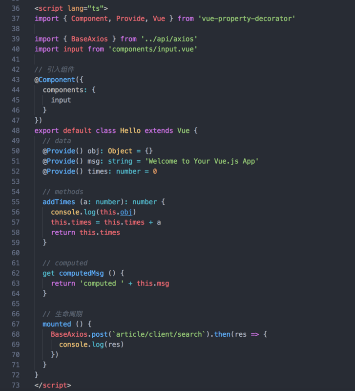

## 一、 目录

1. 安装vue-cli
2. 安装ts依赖
3. 配置webpack
4. 添加tsconfig.json
5. 添加tslint.json
6. 让他ts识别.vue
7. 改造.vue文件

## 二、什么是typeScript

TypeScript是Javascript的强类型版本，然后在编译器去掉类型和特有语法，生成纯粹的Javascript代码。犹豫最终在浏览器中运行的仍然是Javascript，所以TypeScript并不依赖于浏览器的支持，也并不会带来兼容性问题。

TypeScript是Javascript的超集，这意味这他支持所有的Javascript语法，并在此只是对Javascript添加了一些扩展，如class/interface/module等，这样大大提高了代码的可阅读性。

与此同时，TypeScript也是Javascript ES6的超集，Google的Angular2.0叶宣布采用TypeScript进行开发。这更吃粉说明了这是一门面向未来并且脚踏实地的语言。

> 强类型检查可以避免很多不必要的错误，不用在调试的时候才发现问题。

强类型的优势在于静态类型检查，[参考](https://www.zhihu.com/question/28016252/answer/39056940)，概况来说有一些几点：

1. 静态类型检查
2. IDE只能提示
3. 代码重构
4. 可读性

## 三、一个vue组件例子：

## 四、安装TypeScript

<pre>//安装vue的官方插件
npm i vue-class-component vue-property-decorator --save

// ts-loader typescript 必须安装，其他的相信你以后也会装上的
npm i ts-loader typescript tslint tslint-loader tslint-config-standard --save-dev

//vue-class-component：强化 Vue 组件，使用 TypeScript/装饰器 增强 Vue 组件
//vue-property-decorator：在 vue-class-component 上增强更多的结合 Vue 特性的装饰器
//ts-loader：TypeScript 为 Webpack 提供了 ts-loader，其实就是为了让webpack识别 .ts .tsx文件
//tslint-loader跟tslint：我想你也会在.ts .tsx文件 约束代码格式（作用等同于eslint）
//tslint-config-standard：tslint 配置 standard风格的约束</pre>

## 五、webpack配置

1. 首先找到./build/webpack.base.conf.js，找到entry.app，将main.js改成main.ts
2. 找到resolve.extensions里面加上.ts后缀（是未来之后引入.ts 的时候不写后缀）：extensions: ['.js', '.vue', '.json', '.ts'],
3. 找到module.rules，添加webpack对.ts的解析，loader

	<pre>{
		test: /.ts$/,
		loader: 'eslint-loader',
		enforce: 'pre',
		include: [resolve('src'), resolve("test")],
		options: {
			formatter: require("eslint-friendly-formatter")
		}
	},
	{
		test: /.tsx?$/,
		loader: 'ts-loader',
		enforce: 'pre',
		include: /node_modules/,
		options: {
			appendTsSuffixTo: [/\.vue$/]
		}
	}</pre>

https://segmentfault.com/a/1190000011744210#articleHeader12

https://segmentfault.com/a/1190000011864013